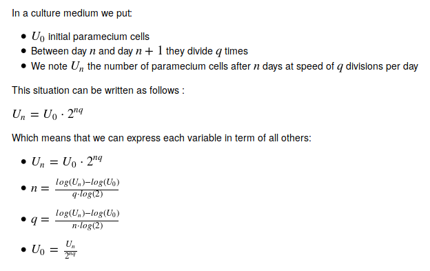
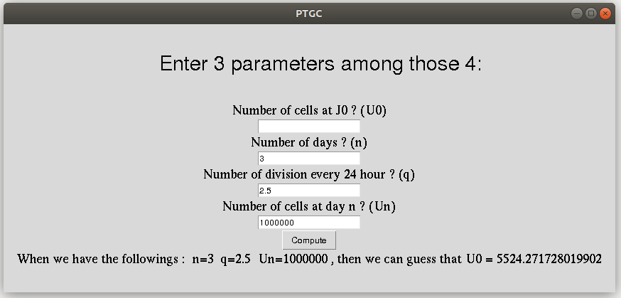

# PTGC

Paramecium tetraurelia Growth calculator

A GUI program to help experimentalists with repetitive calculations of population growth for paramecium tetraurelia

# Principle



# Screenshot




# Installation

## Windows

- Go download the v1.0 at https://github.com/GDelevoye/PTGC/releases/tag/1.0

- Download the **.exe and the .dll file**

- **Put them in the same directory**

- **Double click on the .exe file to launch PTGC**

## Linux, MacOS (command-line)

```bash
user@computer$:git clone https://github.com/GDelevoye/PTGC.git
user@computer$:pip install ./PTGC
```

# Usage

## Linux, MACOS

```bash
user@computer$:PTGC_GUI
```

## Windows

Just use the .exe file as described earlier

# Credits

Guillaume DELEVOYE - 2020
